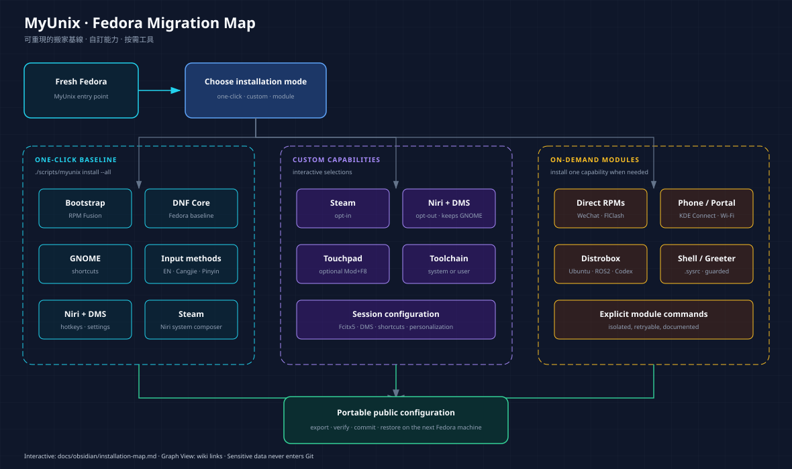
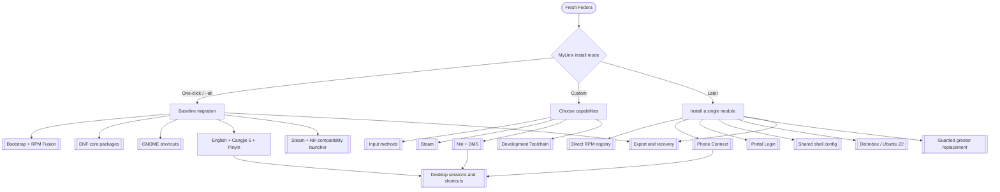

# MyUnix 安裝地圖

> 給第一次使用 MyUnix 的人：先看這頁，再開 [[workstation]] 或執行安裝。

這張圖是可分享的總覽；下面的 Mermaid 圖與 `[[wiki links]]` 才是
Obsidian 裡會隨文件關係持續更新的互動地圖。

## 安裝模式

## 一鍵基線

`./scripts/myunix install --all` 安裝可重現的 Fedora 基線：

- [[../modules/bootstrap|Bootstrap + RPM Fusion]]
- [[../modules/dnf|DNF core packages]]
- [[../modules/gnome|GNOME shortcuts]]
- [[../modules/input-method|English、Cangjie 5、Pinyin]]
- [[../modules/steam|Steam]]，含 Niri 的 `-system-composer` 相容啟動器

[[../modules/rpm|Direct RPM registry]] 會一起驗證 manifest，但 WeChat、
FlClash 等下載型應用維持為明確管理的選用項，不在基線中偷偷下載。

## 自訂勾選

自訂安裝讓你先選擇輸入法，然後依序選擇：

- [[../modules/steam|Steam]]
- [[../modules/niri-dms|Niri + DMS]]，可附加 `Mod+F8` touchpad toggle
- [[../modules/development-toolchain|Development Toolchain]] 的元件與系統／使用者層範圍

GNOME 會保留；Niri 是並存的登入 session。[[session]] 記錄輸入法、
快捷鍵、DMS personalization 和 KDE Connect 的界線。

## 按需模組

| 需求 | 模組／入口 |
| --- | --- |
| WeChat、FlClash、受 checksum 保護的下載 RPM | [[../modules/rpm|Direct RPM registry]] |
| 校園網 captive portal | [[../modules/portal-login|Portal Login]] |
| 手機配對 | [[../modules/phone-connect|Phone Connect]] |
| Bash/Zsh 共用設定 | [[../modules/shell-config|Shared shell config]] |
| Ubuntu container | [[../modules/distrobox|Distrobox]] |
| ROS 2 Humble、container Codex | `distrobox-ros2-humble`、`distrobox-codex` modules |
| 更換 GDM | `niri-dms-greeter` guarded module |

## 導覽順序

1. 從 [[workstation]] 了解 Fedora、GNOME 與 Niri 的關係。
2. 從 [[modules]] 確認每個模組的責任、來源與可移植邊界。
3. 用 [[recovery]] 的命令在新電腦匯出、安裝、重試或修復。

#myunix #fedora #installation #migration #obsidian
