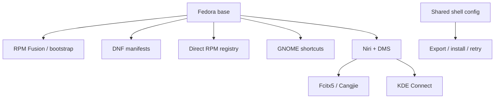

# Fedora workstation

[[MyUnix migration graph|MyUnix]] manages a Fedora workstation that keeps
GNOME available while allowing an optional Niri + DMS session.

For an at-a-glance list of what is installed automatically versus selected
later, open [[installation-map]].

## Main paths

- [[modules]] owns installation sources and module boundaries.
- [[session]] records desktop-session configuration and shortcuts.
- [[recovery]] gives the commands for migration and repair.

## Documentation links

- [[../modules/bootstrap|Bootstrap and RPM Fusion]]
- [[../modules/dnf|DNF packages]]
- [[../modules/rpm|Direct RPM applications]]
- [[../modules/gnome|GNOME shortcuts]]
- [[../modules/niri-dms|Niri + DMS]]
- [[../modules/input-method|Chinese input]]
- [[../modules/phone-connect|Phone Connect]]

#fedora #gnome #niri #dms
