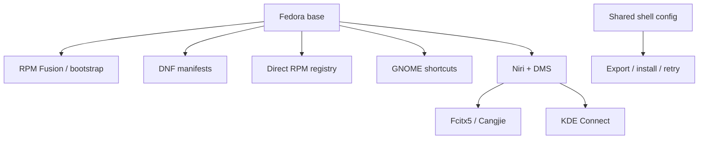

# Migration Graph and Niri/DMS Session Synchronization Implementation Plan

> **For agentic workers:** REQUIRED SUB-SKILL: Use superpowers:executing-plans to implement this plan task-by-task. Steps use checkbox (`- [ ]`) syntax for tracking.

**Goal:** Synchronize the reproducible Fedora GNOME + Niri/DMS migration state, package manifests, and an Obsidian-native graph before pushing `fedora`.

**Architecture:** `docs/obsidian/` is a versioned Markdown graph with no server or tracked vault state. The Niri exporter uses a strict KDL allowlist. Package availability is checked through DNF only after a module's documented repositories are enabled.

**Tech Stack:** Bash, DNF/libdnf5, Niri KDL, DMS, Obsidian Markdown, Mermaid.

## Global Constraints

- Work directly in the local `fedora` checkout; do not reset or overwrite unrelated user work.
- Never export credentials, account data, phone pairing data, cache, DMS private state, wallpaper paths, or timestamped backups.
- Keep `--all` GNOME-safe; do not add Niri/DMS or greeter replacement to it.
- The greeter remains separately gated by `MYUNIX_CONFIRM_GREETER=replace-gdm`.
- Only package, repository, and firewall operations may use `sudo`.
- Run all local verification before staging, committing, or pushing the user-authorized branch.

---

### Task 1: Add the Obsidian migration graph

**Files:**
- Create: `docs/obsidian/README.md`, `workstation.md`, `modules.md`, `session.md`, `recovery.md`
- Create: `tests/test_obsidian_graph.sh`
- Modify: `.gitignore`, `README.md`

**Interfaces:** Produces normal `[[wiki links]]` for Obsidian Graph View; consumes the existing module docs and CLI commands.

- [ ] **Step 1: Write the failing graph test**

```bash
for note in README workstation modules session recovery; do
  [[ -f "$PROJECT_ROOT/docs/obsidian/$note.md" ]] || exit 1
done
rg -Fq '[[workstation]]' "$PROJECT_ROOT/docs/obsidian/README.md"
rg -Fq '[[modules]]' "$PROJECT_ROOT/docs/obsidian/workstation.md"
rg -Fq '[[session]]' "$PROJECT_ROOT/docs/obsidian/workstation.md"
rg -Fq '[[recovery]]' "$PROJECT_ROOT/docs/obsidian/workstation.md"
```

- [ ] **Step 2: Run `bash tests/test_obsidian_graph.sh` and confirm it fails because the graph notes do not exist.**

- [ ] **Step 3: Create the five notes.** `README.md` explains opening this repository as an Obsidian vault and not committing `.obsidian/`; `workstation.md` is the hub and contains this overview:



`modules.md` links all eight modules and their guides. `session.md` records the ownership boundary for Niri KDL, DMS KDL, Fcitx and launcher adapters. `recovery.md` lists only `doctor`, `export`, `install --guided`, `install --module niri-dms`, `install --module input-method`, and `retry`.

- [ ] **Step 4: Add `.obsidian/` to `.gitignore`, add an Obsidian-graph link to `README.md`, then run:**

```bash
bash tests/test_obsidian_graph.sh
rg -n 'TODO|TBD|FIXME' docs/obsidian || true
git diff --check
```

Expected: graph test and diff check exit 0; the placeholder scan has no output.

- [ ] **Step 5: Commit:**

```bash
git add .gitignore README.md docs/obsidian tests/test_obsidian_graph.sh
git commit -m "docs: add Obsidian migration graph"
```

### Task 2: Export Niri and DMS configuration through a public KDL allowlist

**Files:**
- Modify: `modules/niri-dms/export.sh`, `modules/niri-dms/install.sh`, `tests/test_niri_dms.sh`, `docs/modules/niri-dms.md`
- Create: `modules/niri-dms/plugins.txt`

**Interfaces:** Consumes `~/.config/niri/config.kdl` and `dms/*.kdl`; produces exactly those public files in `modules/niri-dms/config/niri/`. `phone-connect` remains the sole owner of `myunix/kdeconnect.kdl`.

- [ ] **Step 1: Write a failing temporary-home test** in `tests/test_niri_dms.sh`. It creates `config.kdl`, `dms/binds.kdl`, `dms/alttab.kdl`, `myunix/kdeconnect.kdl`, and `config.kdl.backup.private`; it calls `export_niri_dms` with `MYUNIX_NIRI_DMS_CONFIG_TARGET`; it asserts that `config.kdl` and `binds.kdl` are exported while both `config.kdl.backup.private` and `myunix/kdeconnect.kdl` are absent.

- [ ] **Step 2: Run `bash tests/test_niri_dms.sh` and confirm failure** because `export_niri_dms` lacks a target override.

- [ ] **Step 3: Implement the smallest allowlist.** In `modules/niri-dms/export.sh` set:

```bash
target="${MYUNIX_NIRI_DMS_CONFIG_TARGET:-$module_dir/config/niri}"
```

Copy only `config.kdl`, then loop only over `dms/*.kdl`; never recurse. Do not export or import `myunix/*.kdl`, because its KDE Connect fragment belongs to `phone-connect` and is already exported by `modules/phone-connect/export.sh`.

- [ ] **Step 4: Verify implementation:**

```bash
bash tests/test_niri_dms.sh
bash -n modules/niri-dms/install.sh modules/niri-dms/export.sh
niri validate -c modules/niri-dms/config/niri/config.kdl
```

Expected: exit 0; an optional-include warning is acceptable only for an intentionally absent optional fragment.

- [ ] **Step 5: Document that `dms/binds.kdl` is the synchronized shortcut source, `dms/alttab.kdl` is generated and not hand-edited, and DMS JSON/plugin/private state is excluded. Commit:**

```bash
git add modules/niri-dms tests/test_niri_dms.sh docs/modules/niri-dms.md
git commit -m "feat: export public Niri and DMS KDL fragments"
```

- [ ] **Step 6: Recreate the reviewed DMS plugins from `plugins.txt`.** Add the public plugin IDs `dankActions`, `dankGifSearch`, and `dankKDEConnect`; have `install_niri_dms` install each through `dms plugins install <id>` after DMS itself is installed. Test the command loop with a stubbed `dms` function. Do not export plugin settings, metadata, pairing state or local plugin repositories.

### Task 3: Verify DNF manifests and make Niri/DMS package ownership explicit

**Files:**
- Modify: `modules/dnf/install.sh`, `modules/niri-dms/install.sh`, `scripts/myunix`, `docs/modules/dnf.md`, `docs/modules/niri-dms.md`
- Create: `modules/niri-dms/packages.txt`, `tests/test_dnf_manifest_verification.sh`

**Interfaces:** `verify_dnf_manifest_available <manifest>` returns 0 only if every non-comment manifest package resolves from currently enabled repositories. Niri/DMS reads only `modules/niri-dms/packages.txt` after enabling its documented COPRs.

- [ ] **Step 1: Write the failing verifier test.** Stub `dnf` so a `missing-package` query returns non-zero; create a manifest containing `git` and `missing-package`; call `verify_dnf_manifest_available`; assert status 1 and output containing `missing-package`.

- [ ] **Step 2: Run `bash tests/test_dnf_manifest_verification.sh` and confirm it fails because the verifier does not exist.**

- [ ] **Step 3: Implement `manifest_packages()` and `verify_dnf_manifest_available()` in `modules/dnf/install.sh`:**

```bash
verify_dnf_manifest_available() {
  local manifest=$1 package missing=0
  validate_dnf_manifest "$manifest" || die "Invalid DNF manifest: $manifest"
  while IFS= read -r package; do
    dnf repoquery --available --quiet "$package" >/dev/null 2>&1 || {
      printf 'Missing DNF package from enabled repositories: %s\n' "$package" >&2
      missing=1
    }
  done < <(manifest_packages "$manifest")
  return "$missing"
}
```

Create `modules/niri-dms/packages.txt` with `dms`, `niri`, `quickshell`, `kitty`, `hyfetch`, and `zsh`; change `install_niri_dms` to enable COPRs, verify this manifest, then install the manifest. Make `run_doctor` verify core, optional, input-method, and Phone Connect manifests but not Niri/DMS, because doctor must not enable optional COPRs.

- [ ] **Step 4: Verify real baseline repository resolution and tests:**

```bash
bash tests/test_dnf_manifest_verification.sh
./scripts/myunix doctor
dnf repoquery --available --quiet git wget curl jq gnome-tweaks dconf-editor ffmpeg vlc
```

Expected: all exit 0. If a package fails, correct the manifest or document its required repository; never use `--skip-unavailable`.

- [ ] **Step 5: Update the DNF/Niri docs and commit:**

```bash
git add modules/dnf modules/niri-dms scripts/myunix tests/test_dnf_manifest_verification.sh docs/modules/dnf.md docs/modules/niri-dms.md
git commit -m "feat: verify Fedora package manifests before installation"
```

### Task 4: Add safe guided migration choices and export the live public state

**Files:**
- Modify: `scripts/myunix`, `README.md`, `docs/verification/fedora-smoke-test.md`, `docs/records/2026-07-14-niri-dms-cangjie.md`, `tests/test_niri_dms.sh`
- Modify only after review: `modules/niri-dms/config/niri/`, `modules/input-method/config/`, `modules/shell-config/config/`, `modules/phone-connect/config/`, `modules/dnf/exported-userinstalled.txt`

**Interfaces:** `run_guided_install` prompts for safe optional modules; `run_export` writes only the owned public configuration.

- [ ] **Step 1: Write a failing guided-flow test** that feeds no answers and asserts these prompts in order: `bootstrap`, `dnf`, `rpm`, `gnome`, `input-method`, `niri-dms`, `shell-config`, `phone-connect`. Assert no `niri-dms-greeter` prompt.

- [ ] **Step 2: Run `bash tests/test_niri_dms.sh` and confirm it fails for the missing Niri/DMS guided prompt.**

- [ ] **Step 3: Change only the guided list:**

```bash
for module in bootstrap dnf rpm gnome input-method niri-dms shell-config phone-connect; do
```

Do not change `run_all_install` and do not add the greeter.

- [ ] **Step 4: Export the current public configuration and review its diff:**

```bash
./scripts/myunix export
git diff -- modules/niri-dms/config modules/input-method/config modules/shell-config/config modules/phone-connect/config modules/dnf/exported-userinstalled.txt
```

Confirm `modules/niri-dms/config/niri/dms/binds.kdl` exists. Redact any account, device ID, phone data, token, private absolute path, backup, or generated state before staging.

- [ ] **Step 5: Update README, smoke test, and Cangjie incident record** with the guided Niri/DMS path, graph link, KDL shortcut ownership, and the `./scripts/myunix install --module input-method` adapter rerun command.

- [ ] **Step 6: Verify and commit:**

```bash
bash tests/run.sh
find scripts modules tests -type f -name '*.sh' -print0 | xargs -0 bash -n
niri validate -c modules/niri-dms/config/niri/config.kdl
git diff --check
git add scripts/myunix README.md docs modules/niri-dms/config modules/input-method/config modules/shell-config/config modules/phone-connect/config modules/dnf/exported-userinstalled.txt tests
git commit -m "feat: guide and export Niri DMS migration state"
```

### Task 5: Review, commit remaining intentional changes, and push `fedora`

**Files:** Review all staged files; preserve unrelated `config/` and `readme.md` unless deliberately reviewed and included.

**Interfaces:** Consumes verified local commits and user authorization; produces a remote fast-forward of `fedora`.

- [ ] **Step 1: Review correctness and secrets:**

```bash
git status --short
git diff --check
git diff --cached --check
git diff --cached -- . ':!readme.md'
rg -n -i '(BEGIN (OPENSSH|RSA|EC|DSA) PRIVATE KEY|password=|token=|cookie=|IBUS_ADDRESS=|kdeconnect.*(device|certificate|key))' --cached . || true
```

- [ ] **Step 2: Run final local verification:**

```bash
bash tests/run.sh
find scripts modules tests -type f -name '*.sh' -print0 | xargs -0 bash -n
niri validate -c modules/niri-dms/config/niri/config.kdl
git diff --check
git branch --show-current
git status --short
```

Expected: validation commands exit 0 and the branch is `fedora`.

- [ ] **Step 3: Commit any remaining intentional slice, then push:**

```bash
git push origin fedora
git status --short
git log --oneline -5
```

Expected: `git push` exits 0; report the local branch, final status and verification output.
